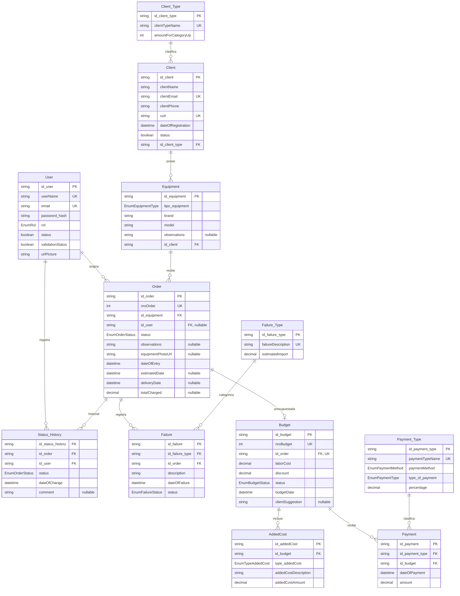

# Modelo de datos vigente

Fuente: [`server/prisma/schema.prisma`](../../server/prisma/schema.prisma). La base de datos es MySQL y Prisma es el ORM. Los identificadores se almacenan como `CHAR(36)` y la validación de entrada exige UUID v7; las capas de persistencia los generan al crear registros. Los importes se guardan como `Decimal`, no como `Float`.

## Diagrama

## Enumeraciones

- `EnumRol`: `admin`, `tecnico`.
- `EnumEquipmentType`: `celular`, `computadora`, `tablet`, `consola`, `notebook`, `impresora`, `televisor`, `otro`.
- `EnumOrderStatus`: `recibido`, `diagnostico`, `presupuestado`, `aprobado`, `reparacion`, `listo`, `entregado`, `cancelado`.
- `EnumBudgetStatus`: `pendiente`, `aprobado`, `rechazado`.
- `EnumPaymentMethod`: `DEBITO`, `MP`, `EFECTIVO`, `CREDITO`.
- `EnumPaymentType`: `Descuento`, `Recargo`.
- `EnumFailureStatus`: `resuelta`, `diagnosticada`.
- `EnumTypeAddedCost`: `repuesto`, `procedimientoEspecial`, `garantia`, `reparacionExpress`, `limpiezaPuestaAPunto`, `serviciosSoftware`.

## Entidades y reglas destacadas

- **User**: `userName` y `email` son únicos. `status` y `validationStatus` comienzan en `false`; la imagen tiene una URL por defecto. La contraseña se persiste como hash.
- **Client**: `clientEmail` y `cuit` son únicos. `cuit` se valida como CUIT de 11 dígitos. Cada cliente pertenece a un `Client_Type`; el estado inicia activo y `dateOfRegistration` se asigna al crear.
- **Client_Type**: `clientTypeName` es único; `amountForCategoryUp` es el umbral entero de categoría.
- **Equipment**: pertenece a un cliente. `tipo_equipment` usa `EnumEquipmentType`; `observations` es opcional.
- **Order**: se relaciona con un equipo y opcionalmente con un usuario. `nroOrder` es único; el estado inicial es `recibido`. Las fechas de estimación/entrega, la foto, las observaciones y el total cobrado son opcionales.
- **Failure**: pertenece a una orden y a un `Failure_Type`; el estado inicial es `diagnosticada`. En el modelo vigente la falla ya no se relaciona directamente con el equipo.
- **Status_History**: registra el estado alcanzado, la orden, el usuario y la fecha del cambio. No contiene campos `previousStatus` ni `newStatus`.
- **Budget**: tiene una relación uno a uno con la orden (`id_order` único). `nroBudget` es único, `discount` inicia en cero y el estado en `pendiente`. El total estimado se calcula en la lógica de negocio y no es una columna del modelo.
- **AddedCost**: representa costos detallados de un presupuesto; cada uno tiene tipo, descripción e importe decimal.
- **Payment_Type**: define método, tipo (descuento/recargo) y `percentage` (el nombre actual reemplaza al antiguo `percentaje`).
- **Payment**: relaciona un importe con un presupuesto y un tipo de pago; la fecha se asigna automáticamente.

## Tipos y valores por defecto relevantes

- Los campos `id_*` son `String @db.Char(36)` y las rutas validan sus valores como UUID v7.
- Los importes monetarios (`estimatedImport`, `totalCharged`, `laborCost`, `discount`, `addedCostAmount`, `percentage`, `amount`) usan `Decimal` con precisión definida en el schema.
- Los valores automáticos incluyen estados iniciales, fecha de alta/registro y valores de descuento/imagen indicados en cada modelo.
- Los nombres de tablas se mapean a los definidos mediante `@@map`; `AddedCost` y `Payment` conservan los nombres de modelo indicados por Prisma.
