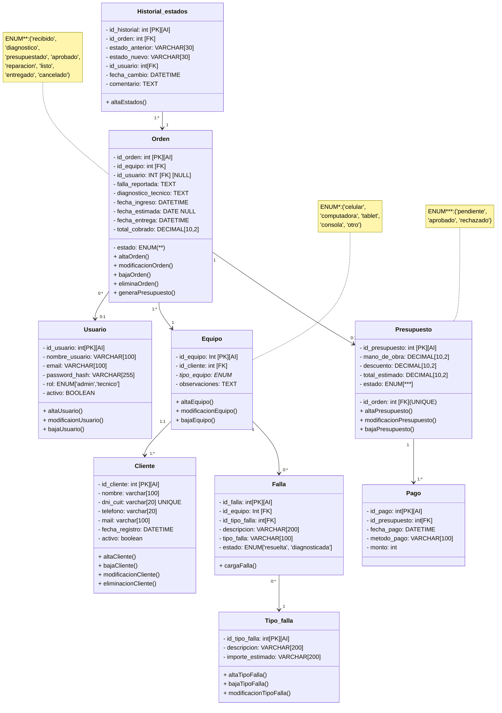

# Propuesta TP DSW

## Grupo

### Integrantes

* 53769 - Rego, Matias Miguel Angel.
* 54822 - Bautista, Isaac Juan.
* 55425 - Vigistain, Tomas.

### Repositorios

* [fullstack app.](https://github.com/Matias-rego/TP-DS-Isaac-Rego-Vigistain)(monorepo).

## Tema

### Descripción

El negocio consiste en un taller de reparaciones de dispositivos electrónicos que brinda servicios de reparación y mantenimiento de equipos. A partir de esto se propone desarrollar un sistema web de gestión para digitalizar y centralizar las operaciones del taller. El sistema permitirá registrar órdenes de trabajo, controlar el estado de las reparaciones, gestionar clientes y administrar el inventario, con el objetivo de mejorar la organización y el seguimiento del servicio.

### Modelo

## Alcance Funcional

### Alcance Mínimo

Regularidad:

| Req                         | Detalle                                                                                                                                                                                                                                                                                                                                                                                |
|-----------------------------|----------------------------------------------------------------------------------------------------------------------------------------------------------------------------------------------------------------------------------------------------------------------------------------------------------------------------------------------------------------------------------------|
| CRUD simple                 | 1\. CRUD Tipo_Falla 2. CRUD Equipo 3. CRUD Orden                                                                                                                                                                                                                                                                                                                             |
| CRUD dependiente            | 1\. CRUD falla {depende de} CRUD Tipo_falla y CRUD Equipo 2. CRUD Historial_estado {depende de} CRUD Orden y CRUD Usuario                                                                                                                                                                                                                                                         |
| Listado + detalle | 1\. Fallas de los equipos ordenadas segun su frecuencia de  ocurrencia => detalle CRUD Fallas  2. Equipos que se encuentran en un determinado estado posible, muestra estado anterior, fecha de cambio de estado, tecnico a cargo, informacion del equipo correspondiente. => detalle muestra datos completos del cambio de estado, del equipo en cuestion y del tecnico a cargo. |
| CUU/Epic                    | 1\. Generar orden de trabajo 2. Realizar presupuesto de reparacion y realizacion de pago/s                                                                                                                                                                                                                                                                                        |

Adicionales para Aprobación

| Req      | Detalle                                                                                                                                                                                                                                                                                                               |
|----------|-----------------------------------------------------------------------------------------------------------------------------------------------------------------------------------------------------------------------------------------------------------------------------------------------------------------------|
| CRUD     | 1\. CRUD Tipo_Falla 2. CRUD Equipo 3. CRUD Orden 4. CRUD Usuario 5. CRUD Presupuesto 6. CRUD Cliente 7. CRUD Pago {depende de} CRUD Presupuesto  8. CRUD Falla {depende de} CRUD Tipo_falla y CRUD Equipo  9. 2. CRUD Historial_estado {depende de} CRUD Orden y CRUD Usuario |
| CUU/Epic | 1\. Generar orden de trabajo  2. Realizar presupuesto de reparacion y realizacion de pago/s  3.  Generar Reportes estadistidos de fallas                                                                                                                                                                    |

### Alcance Adicional Voluntario

| Req      | Detalle                                                                                                                                                                                                                 |
|----------|-------------------------------------------------------------------------------------------------------------------------------------------------------------------------------------------------------------------------|
| Listados | 1\. Clientes registrados ordenados por antiguedad de los mismos   2. Equipos que ya hayan cumplido su fecha estimada de entrega o se encuentren a pocos dias de cumplirla                                          |
| CUU/Epic | 1\. Consultar estados de una orden  2. Cancelación de Orden                                                                                                                                                        |
| Otros    | 1\. Enviar mail acerca del cambio de estado de una orden a su respectivo cliente   2. Enviar presupuesto de la orden a traves del mail registrado a cada cliente y esperar la respuesta de confirmacion del mismo. |
