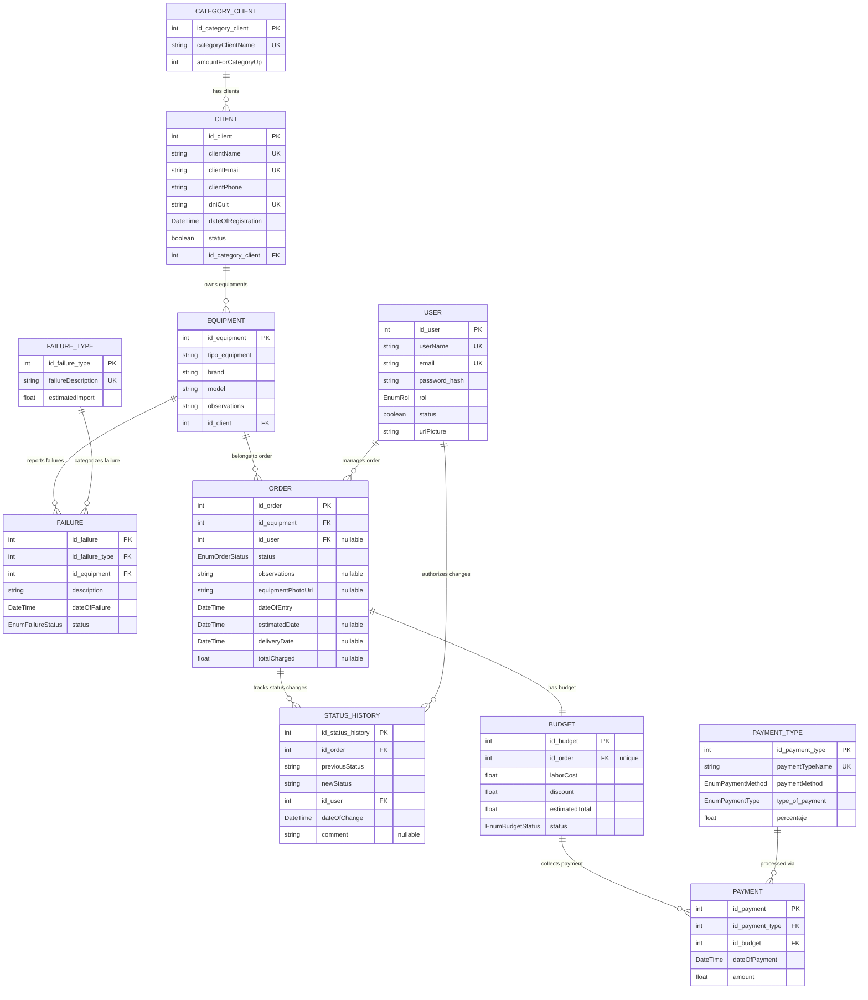

# Propuesta TP DSW

## Grupo

### Integrantes

* 53769 - Rego, Matias Miguel Angel.
* 54822 - Bautista, Isaac Juan.
* 55425 - Vigistain, Tomas.

### Repositorios

* [fullstack app.](https://github.com/Matias-rego/TP-DS-Isaac-Rego-Vigistain)(monorepo).

## Tema

### Descripción

El negocio consiste en un taller de reparaciones de dispositivos electrónicos que brinda servicios de reparación y mantenimiento de equipos. A partir de esto se propone desarrollar un sistema web de gestión para digitalizar y centralizar las operaciones del taller. El sistema permitirá registrar órdenes de trabajo, controlar el estado de las reparaciones, gestionar clientes y administrar el inventario, con el objetivo de mejorar la organización y el seguimiento del servicio.

### Modelo

---

## 2. Diccionario de Datos y Especificaciones

### 2.1 Enumeraciones (Enums)
* **EnumRol**: `admin`, `tecnico`
* **EnumEquipmentType**: `celular`, `computadora`, `tablet`, `consola`, `otro`
* **EnumOrderStatus**: `recibido`, `diagnostico`, `presupuestado`, `aprobado`, `reparacion`, `listo`, `entregado`, `cancelado`
* **EnumBudgetStatus**: `pendiente`, `aprobado`, `rechazado`
* **EnumPaymentMethod**: `DEBITO`, `MP`, `EFECTIVO`, `CREDITO`
* **EnumPaymentType**: `Descuento`, `Recargo`
* **EnumFailureStatus**: `resuelta`, `diagnosticada`

---

### 2.2 Entidades y Relaciones

#### **User (Usuario)**
* `id_user` (Int, PK, Autoincremental): Identificador único del usuario/operario.
* `userName` (String, Único): Nombre de usuario para ingreso.
* `email` (String, Único): Correo electrónico.
* `password_hash` (String): Contraseña encriptada.
* `rol` (EnumRol): Rol asignado (`admin` o `tecnico`).
* `status` (Boolean, Default: `true`): Estado de activación de la cuenta.
* `urlPicture` (String): Imagen de perfil (con valor por defecto).

#### **Client (Cliente)**
* `id_client` (Int, PK, Autoincremental): Identificador único de cliente.
* `clientName` (String, Único): Nombre o razón social.
* `clientEmail` (String, Único): Correo electrónico de contacto.
* `clientPhone` (String): Teléfono.
* `dniCuit` (String, Único): Identificación fiscal/personal.
* `dateOfRegistration` (DateTime, Default: `now`): Fecha de alta.
* `status` (Boolean, Default: `true`): Estado activo/inactivo.
* `id_category_client` (Int, FK): Referencia a la categoría del cliente.

#### **Category_Client (Categoría de Cliente)**
* `id_category_client` (Int, PK, Autoincremental): Identificador único de categoría.
* `categoryClientName` (String, Único): Nombre de la categoría.
* `amountForCategoryUp` (Int): Monto umbral para la categoría.

#### **Equipment (Equipos)**
* `id_equipment` (Int, PK, Autoincremental): Identificador único del equipo.
* `tipo_equipment` (String): Tipo de equipo (celular, notebook, etc.).
* `brand` (String): Marca.
* `model` (String): Modelo.
* `observations` (String): Detalles físicos de recepción.
* `id_client` (Int, FK): Referencia al dueño (`Client`).

#### **Failure_Type (Tipos de Falla)**
* `id_failure_type` (Int, PK, Autoincremental): Identificador de la falla patrón.
* `failureDescription` (String, Único): Descripción típica del problema.
* `estimatedImport` (Float): Importe estimado sugerido.

#### **Failure (Fallas de Equipo)**
* `id_failure` (Int, PK, Autoincremental): Falla específica registrada.
* `id_failure_type` (Int, FK): Vínculo con el tipo de falla.
* `id_equipment` (Int, FK): Equipo que presenta la falla.
* `description` (String): Notas detalladas de esta falla en particular.
* `dateOfFailure` (DateTime): Registro temporal del fallo.
* `status` (EnumFailureStatus): Estado de la falla (`diagnosticada`, `resuelta`).

#### **Order (Órdenes de Trabajo)**
* `id_order` (Int, PK, Autoincremental): Número de orden.
* `id_equipment` (Int, FK): Equipo asociado.
* `id_user` (Int, FK, Opcional): Técnico asignado a resolverla.
* `status` (EnumOrderStatus): Estado de avance del servicio.
* `observations` (String, Opcional): Observaciones de la orden.
* `equipmentPhotoUrl` (String, Opcional): Foto de estado del equipo.
* `dateOfEntry` (DateTime): Fecha de ingreso al taller.
* `estimatedDate` (DateTime, Opcional): Fecha de entrega estimada.
* `deliveryDate` (DateTime, Opcional): Fecha real de retiro.
* `totalCharged` (Float, Opcional): Monto final cobrado.

#### **Status_History (Historial de Cambios)**
* `id_status_history` (Int, PK, Autoincremental): Auditoría de cambios de estado.
* `id_order` (Int, FK): Orden afectada.
* `previousStatus` (String): Estado anterior.
* `newStatus` (String): Estado nuevo.
* `id_user` (Int, FK): Usuario que realizó la acción.
* `dateOfChange` (DateTime): Momento exacto de la modificación.
* `comment` (String, Opcional): Motivo del cambio.

#### **Budget (Presupuesto)**
* `id_budget` (Int, PK, Autoincremental): Identificador único de presupuesto.
* `id_order` (Int, FK, Único): Relación unívoca (1 a 1) con la Orden de Trabajo.
* `laborCost` (Float): Costo de mano de obra.
* `discount` (Float, Default `0`): Descuento aplicado.
* `estimatedTotal` (Float): Cálculo del total estimado.
* `status` (EnumBudgetStatus): Estado de la aprobación.

#### **Payment_Type (Tipos de Pago)**
* `id_payment_type` (Int, PK, Autoincremental): Configuración de medio de cobro.
* `paymentTypeName` (String, Único): Nombre descriptivo (ej. "MercadoPago Promo").
* `paymentMethod` (EnumPaymentMethod): Categoría del método.
* `type_of_payment` (EnumPaymentType): Define si genera recargo o descuento.
* `percentaje` (Float): Alícuota de recargo/descuento.

#### **Payment (Transacciones / Pagos)**
* `id_payment` (Int, PK, Autoincremental): Registro individual de transacción.
* `id_payment_type` (Int, FK): Tipo de pago seleccionado.
* `id_budget` (Int, FK): Presupuesto que se cancela con este pago.
* `dateOfPayment` (DateTime): Fecha del abono.
* `amount` (Float): Monto pagado.
## Alcance Funcional

### Alcance Mínimo

Regularidad:

| Req                         | Detalle                                                                                                                                                                                                                                                                                                                                                                                |
|-----------------------------|----------------------------------------------------------------------------------------------------------------------------------------------------------------------------------------------------------------------------------------------------------------------------------------------------------------------------------------------------------------------------------------|
| CRUD simple                 | 1\. CRUD Tipo_Falla 2. CRUD Tipo_Cliente 3. CRUD Tipo_Pago                                                                                                                                                                                                                                                                                                                             |
| CRUD dependiente            | 1\. CRUD falla {depende de} CRUD Tipo_falla y CRUD Equipo 2. CRUD Cliente {depende de} CRUD Tipo_Pago                                                                                                                                                                                                                                                        |
| Listado + detalle | 1\. Fallas de los equipos ordenadas segun su frecuencia de  ocurrencia => detalle CRUD Fallas  2. Equipos que se encuentran en un determinado estado posible, muestra estado anterior, fecha de cambio de estado, tecnico a cargo, informacion del equipo correspondiente. => detalle muestra datos completos del cambio de estado, del equipo en cuestion y del tecnico a cargo. |
| CUU/Epic                    | 1\. Generar orden de trabajo 2. Realizar presupuesto de reparacion y realizacion de pago/s                                                                                                                                                                                                                                                                                        |

Adicionales para Aprobación

| Req      | Detalle                                                                                                                                                                                                                                                                                                               |
|----------|-----------------------------------------------------------------------------------------------------------------------------------------------------------------------------------------------------------------------------------------------------------------------------------------------------------------------|
| CRUD     | 1\. CRUD Tipo_Falla 2. CRUD Equipo 3. CRUD Tipo_Cliente 4. CRUD Usuario  5. CRUD Cliente 6. CRUD Falla {depende de} CRUD Tipo_falla y CRUD Equipo  
| CUU/Epic | 1\. Generar orden de trabajo  2. Realizar presupuesto de reparacion y realizacion de pago/s  3.  Generar Reportes estadistidos de fallas                                                                                                                                                                    |

### Alcance Adicional Voluntario

| Req      | Detalle                                                                                                                                                                                                                 |
|----------|-------------------------------------------------------------------------------------------------------------------------------------------------------------------------------------------------------------------------|
| Listados | 1\. Clientes registrados ordenados por antiguedad de los mismos   2. Equipos que ya hayan cumplido su fecha estimada de entrega o se encuentren a pocos dias de cumplirla                                          |
| CUU/Epic | 1\. Consultar estados de una orden  2. Cancelación de Orden                                                                                                                                                        |
| Otros    | 1\. Enviar mail acerca del cambio de estado de una orden a su respectivo cliente   2. Enviar presupuesto de la orden a traves del mail registrado a cada cliente y esperar la respuesta de confirmacion del mismo. |
